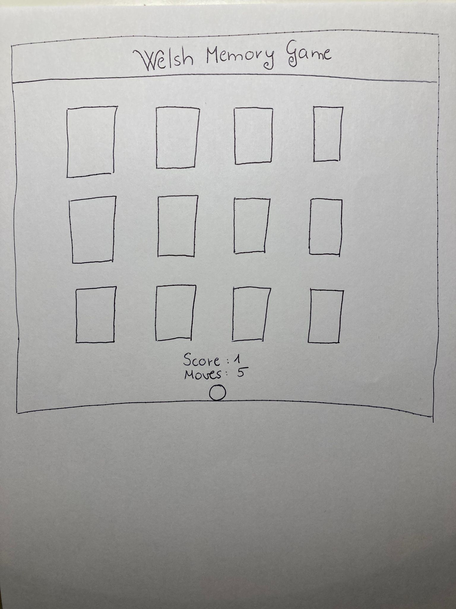

# Welsh Memory Game

## The goal for this project

The Welsh Memory Game is a card memory game that tests the user's memory in a fun way. The goal is to match all pairs of identical photos with the least amount of moves. The photos on the cards try to give a taste of the life in Wales.

## Site Owner Goals

- To provide  an amusing game for the user.
- To present the user with a website that is fully responsive and gives the mood of Wales through the use of appropriate colors and imagery.

## User stories

- As an user I want to understand the main purpose of the website.
- As an user I want to to enjoy a simple memory card game with visually appealing format.
- As an user I want to view and match photos of Wales.
- As an user I want to play a game that doesn't take too long but has a challenge. 
- As an user I want to be able to compete with my friends by trying to beat the others moves's.

## UX

### Fonts

- I have used Google Fonts to find the font that suits best to the feel of the website. I have used [Cinzel Decorative](https://fonts.google.com/specimen/Cinzel+Decorative) for the website. I used Cursive as backup font, in case for any reason the main font isn't able to load correctly.

### Icons

- The icon in the footer were taken from [GitHub](https://github.com/logos).

### Colors and images

- The main colours on the website are green, white, and brown. I choosed these colours to refer to the wonderful natural treasures of Wales. The white text has a nice contrast with the green background making it easy to read.
- The photos on the cards are one of the most important parts of the website, they have similar vibes, they give a taste of the beautiful Wales.
- The backface of the cards is the map of Wales with an old photo effect. I edited this picture myself. 

### Wireframes

<b>Wireframes</b> (click to expand)

## Features
### Existing Features
### Features left to implement

## Technologies used
### Languages
### Frameworks, Tools and Libraries

## Testing

To view all testing documentation please refer to [TESTING.md](TESTING.md).

## Deployment

The site was deployed to GitHub Pages. The steps to deploy are as follows: 
  - In the [GitHub repository](https://github.com/berill98/welsh-memory-game), navigate to the Settings tab 
  - From the source section drop-down menu, select the **Main** Branch, then click "Save".
  - The page will be automatically refreshed with a detailed ribbon display to indicate the successful deployment.

  The live link can be found [here](https://berill98.github.io/welsh-memory-game/).

### Local Deployment

In order to make a local copy of this project, you can clone it. In your IDE Terminal, type the following command to clone the repository:

- `git clonehttps://github.com/berill98/welsh-memory-game.git`

Alternatively, if using Gitpod, you can click below to create your own workspace using this repository.

## Credits

### Media
### Resources used

### Setup and text in README.md

I have used my own README.md file from MS1 as inspiration for this README.md.

## Acknowledgments

My mentor Tim for his support and advice.