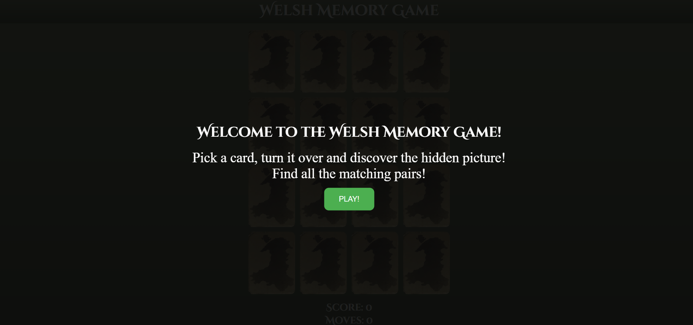
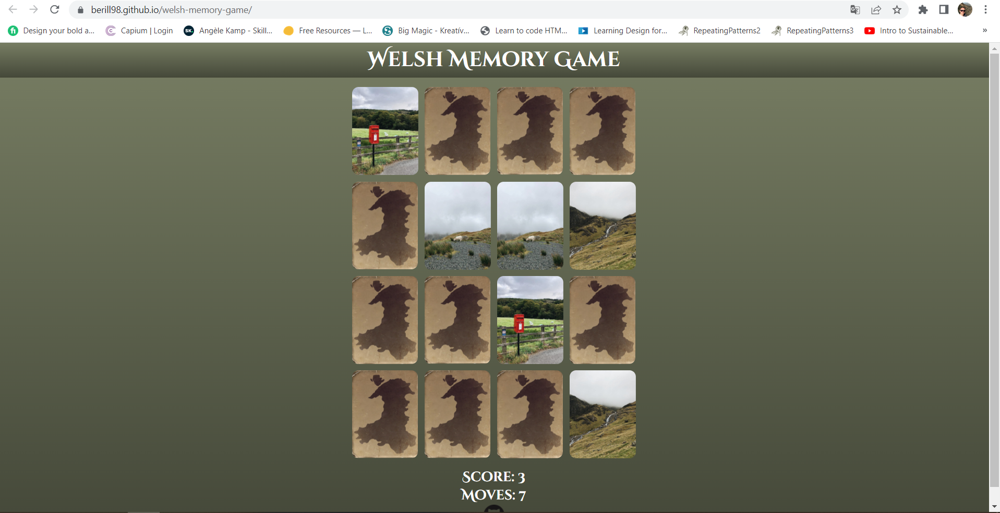
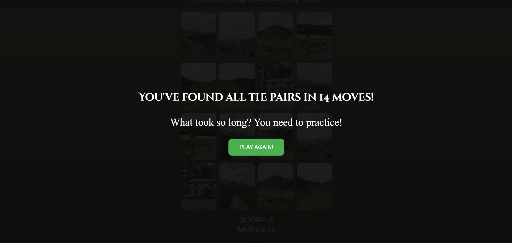

# Welsh Memory Game

## The goal for this project

The Welsh Memory Game is a card memory game that tests the user's memory in a fun way. The goal is to match all pairs of identical photos with the least amount of moves. The photos on the cards try to give a taste of the life in Wales.

## Site Owner Goals

- To provide  an amusing game for the user.
- To present the user with a website that is fully responsive and gives the mood of Wales through the use of appropriate colors and imagery.

## User stories

- As an user I want to understand the main purpose of the website.
- As an user I want to to enjoy a simple memory card game with visually appealing format.
- As an user I want to view and match photos of Wales.
- As an user I want to play a game that doesn't take too long but has a challenge. 
- As an user I want to be able to compete with my friends by trying to beat the others moves's.

## UX

### Fonts

- I have used Google Fonts to find the font that suits best to the feel of the website. I have used [Cinzel Decorative](https://fonts.google.com/specimen/Cinzel+Decorative) for the website. I used Cursive as backup font, in case for any reason the main font isn't able to load correctly.

### Icons

- The icon in the footer were taken from [GitHub](https://github.com/logos).

### Colors and images

- The main colours on the website are green, white, and brown. I choosed these colours to refer to the wonderful natural treasures of Wales. The white text has a nice contrast with the green background making it easy to read.
- The photos on the cards are one of the most important parts of the website, they have similar vibes, they give a taste of the beautiful Wales.
- The backface of the cards is the map of Wales with an old photo effect. I edited this picture myself. 

### Wireframes

<b>Wireframes</b> (click to expand)

## Features

### Existing Features

- __Welcome modul__

  - This section will allow the user to read the most important information about the Welsh Memory Game.
  - It also contains a call to action button which helps the user to start the game.

  

- __Game board__

  - The game board contains 16 cards with the photos of Wales and allows the user to flip the cards and find the matching pairs.

  

- __Info area__

- This area shows the scores and the moves to the user during the game.

 

- __GitHub icon__

- The footer includes an icon with a link to the GitHub profile of the developer. The link will open to a new tab to allow easy navigation for the user. These link encourage the user to check the other project from the developer.

 

- __Result messages__

- The result messages allows the user to know how many moves did it take to find the pairs.
- This section also contains a call to action button which helps the user to start a new game.

 

### Features left to implement

- Creating a timer for the game.
- Adding background music to the game.

## Technologies used

### Languages

- HTML5
- CSS
- Javascript

### Frameworks, Tools and Libraries

- [Chrome Dev Tools](https://developer.chrome.com/docs/devtools/) - Used for overall development and testing for example the  responsiveness and appearance.
- [Google Fonts](https://fonts.google.com/) - Used to import font to the website.
- [Pho.to](https://funny.pho.to/old-photo-effect/) - Used for the old photo effect for the cards's backface.
- [W3C](https://www.w3.org/) - Used for validation.
- Git - Used for version control.
- [Gitpod](https://gitpod.io/) - Used as a cloud-based IDE.
- [GitHub](https://github.com/) - Used for storing code securely online.
- [GitHub Pages](https://pages.github.com/) - Used for site hosting.

## Testing

To view all testing documentation please refer to [TESTING.md](TESTING.md).

I fully acknowledge and understand that, in a real-world scenario, an extensive set of Jest tests would be more comprehensive.

## Deployment

The site was deployed to GitHub Pages. The steps to deploy are as follows: 
  - In the [GitHub repository](https://github.com/berill98/welsh-memory-game), navigate to the Settings tab 
  - From the source section drop-down menu, select the **Main** Branch, then click "Save".
  - The page will be automatically refreshed with a detailed ribbon display to indicate the successful deployment.

  The live link can be found [here](https://berill98.github.io/welsh-memory-game/).

### Local Deployment

In order to make a local copy of this project, you can clone it. In your IDE Terminal, type the following command to clone the repository:

- `git clonehttps://github.com/berill98/welsh-memory-game.git`

Alternatively, if using Gitpod, you can click below to create your own workspace using this repository.

## Credits

### Media

- All of the photos on the cards are from the same photographer, Lina Kivaka. I used her photos because they are really beautiful and they express the real Welsh atmosphere.

| Media  | Photographer  | Link |
| :------------ |:---------------:| -----:|
| Brook | Lina Kivaka | [Pexels](https://www.pexels.com/hu-hu/foto/termeszet-vizeses-sziklas-hegyseg-termeszetfotozas-5582995/) |
| House | Lina Kivaka | [Pexels](https://www.pexels.com/hu-hu/foto/haz-epiteszet-kohaz-fuggoleges-loves-5582999/) |
| Lake | Lina Kivaka | [Pexels](https://www.pexels.com/hu-hu/foto/termeszet-hegy-to-zold-5582921/) |
| Mailbox | Lina Kivaka | [Pexels](https://www.pexels.com/hu-hu/foto/tajkep-hegyek-mezo-fak-5582986/) |
| Mountain | Lina Kivaka | [Pexels](https://www.pexels.com/hu-hu/foto/termeszet-felhos-hegy-to-5582928/) |
| Path| Lina Kivaka | [Pexels](https://www.pexels.com/hu-hu/foto/hegyek-termeszet-videki-taj-zold-5583021/) |
| Sheep | Lina Kivaka | [Pexels](https://www.pexels.com/hu-hu/foto/videki-taj-kodos-juh-hosszu-loves-5582954/) |
| Village | Lina Kivaka | [Pexels](https://www.pexels.com/hu-hu/foto/hegyek-termeszet-videki-taj-zold-5582926/) |

### Resources used

- Inspiration for the overlay - [W3 Schools](https://www.w3schools.com/howto/howto_css_overlay.asp)
- Inspiration for the Memory Game - [freeCodeCamp.org](https://www.youtube.com/watch?v=ZniVgo8U7ek)

### Setup and text in README.md

I have used my own README.md file from MS1 as inspiration for this README.md.

## Acknowledgments

My mentor Tim for his support and advice.