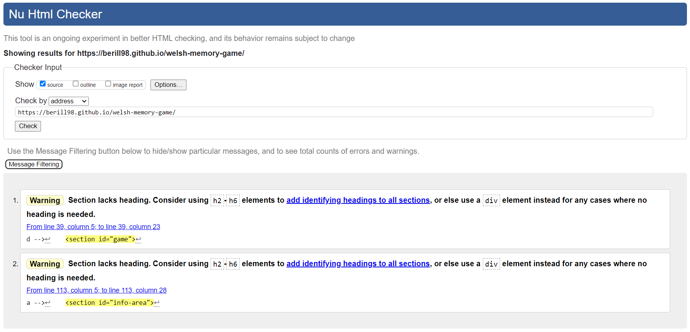
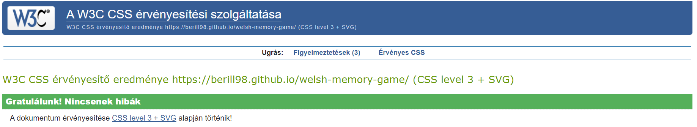
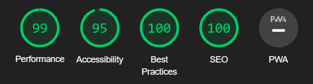
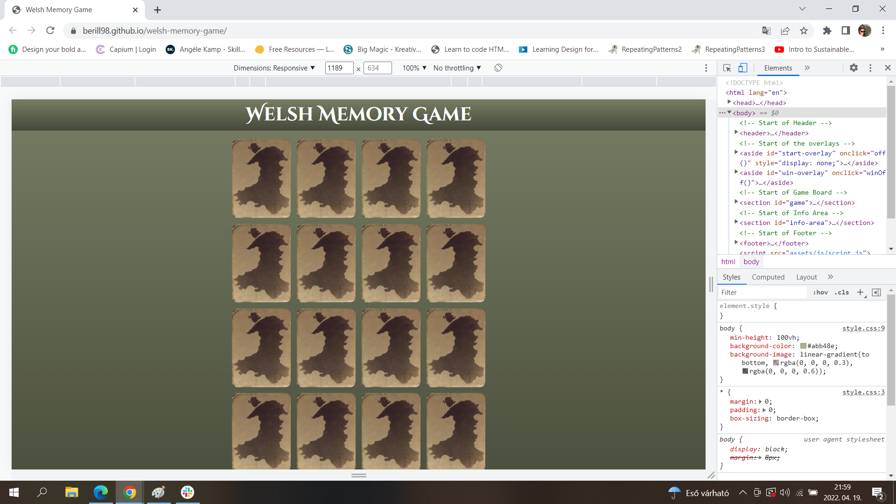
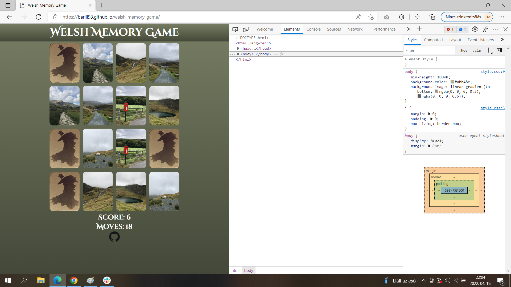
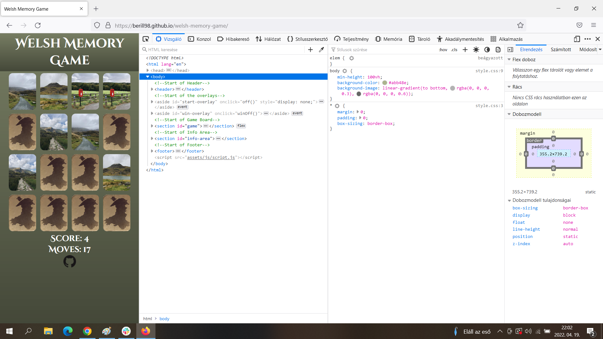

# Testing 

## Validator Testing

- HTML
  - There were no errors however there were two warning returned when passing through the official [W3C validator](https://validator.w3.org/nu/?doc=https%3A%2F%2Fberill98.github.io%2Fwelsh-memory-game%2F).

  

- CSS
  - No errors were found when passing through the official [Jigsaw validator](https://jigsaw.w3.org/css-validator/validator?uri=https%3A%2F%2Fberill98.github.io%2Fwelsh-memory-game%2F&profile=css3svg&usermedium=all&warning=1&vextwarning=&lang=hu).

  

- Javascript

- Accessibility
  - The site achieved a Lighthouse accessibility score of 95% which confirms that the website is accessible.

  

## Responsiveness Testing

- The site was tested on various devices such as desktop, laptops and mobiles to ensure responsiveness. The website performed as intended. The responsive design was also checked using Chrome Developer Tools across multiple devices.

<b>Responsiveness testing</b> (click to expand)

Desktop view

Tablet view

Mobile view

## Browser Testing

- The site was tested on different browsers (Google Chrome, Firefox, Microsoft Edge) without issues.

<b>Browser testing</b> (click to expand)

Google Chrome

Microsoft Edge

Mozzilla Firefox

## Unfixed Bugs

There are no unfixed bugs that I am aware of.

## User story testing